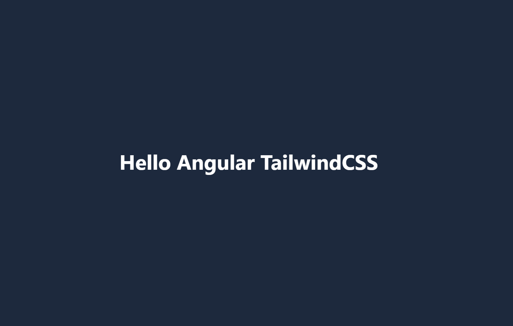
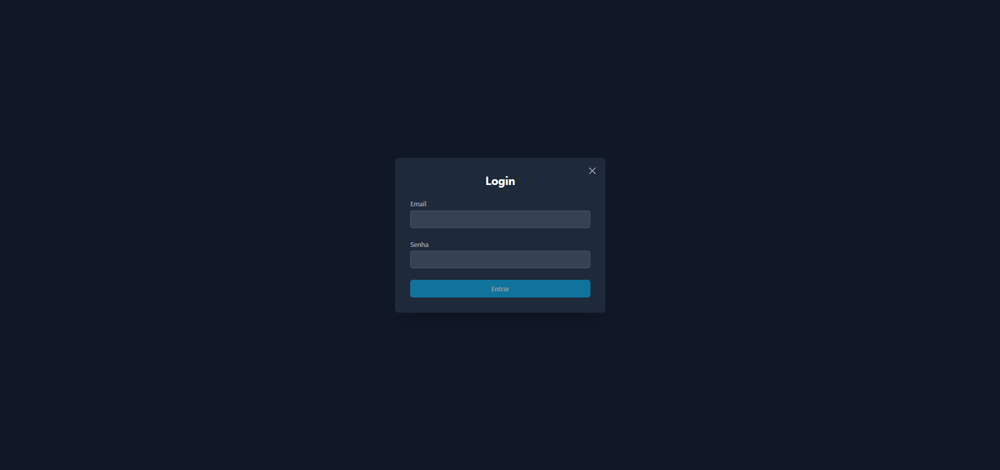
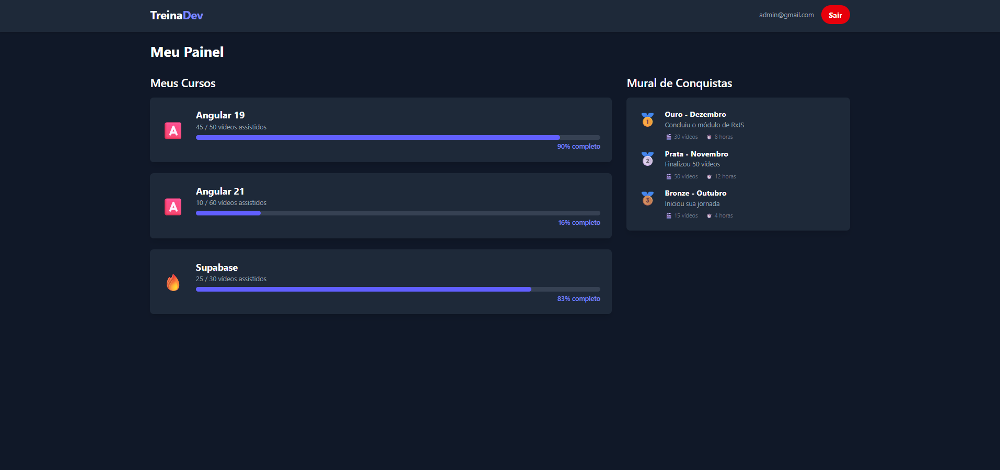

# Angular com Tailwind CSS

Este projeto foi gerado com [Angular CLI](https://github.com/angular/angular-cli) versão 19.2.0 e estilizado com [Tailwind CSS](https://tailwindcss.com/).

## Descrição

Uma aplicação de exemplo que demonstra a integração do Angular com o framework Tailwind CSS para a criação de interfaces de usuário modernas e responsivas.

## Telas

Aqui estão algumas telas da aplicação:

| Tela 01 | Tela 02 | Tela 03 |
| :---: | :---: | :---: |
|  |  |  |

## Pré-requisitos

Antes de começar, certifique-se de ter o [Node.js](https://nodejs.org/) (que inclui o npm) e o [Angular CLI](https://cli.angular.io/) instalados em sua máquina.

## Instalação

1. Clone o repositório:
   ```bash
   git clone https://github.com/srodrigo28/angular-tailwindcss
   ```
2. Navegue até o diretório do projeto:
   ```bash
   cd angular-tailwindcss
   ```
3. Instale as dependências:
   ```bash
   npm install
   ```

## Servidor de Desenvolvimento

Execute `npm start` ou `npx ng serve` para iniciar o servidor de desenvolvimento. Navegue até `http://localhost:4200/`. A aplicação será recarregada automaticamente se você alterar qualquer um dos arquivos de origem.

## Build

Execute `npm run build` ou `npx ng build` para compilar o projeto. Os artefatos da compilação serão armazenados no diretório `dist/`.

## Executando Testes Unitários

Execute `npm test` ou `npx ng test` para executar os testes unitários via [Karma](https://karma-runner.github.io).